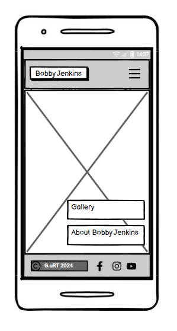
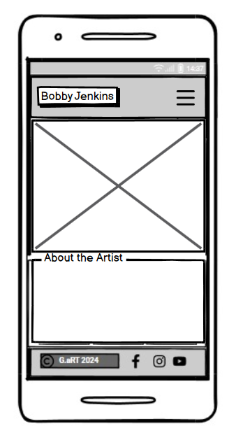
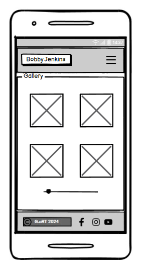
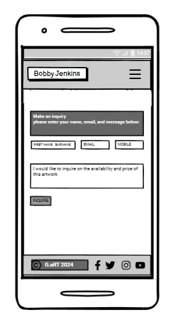
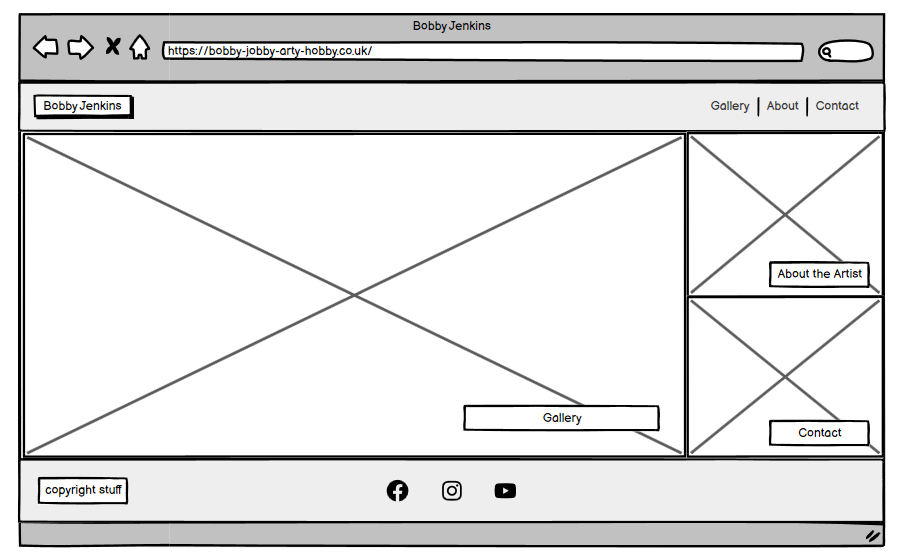
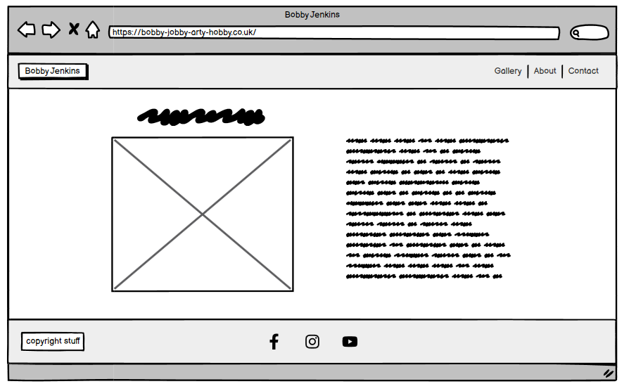
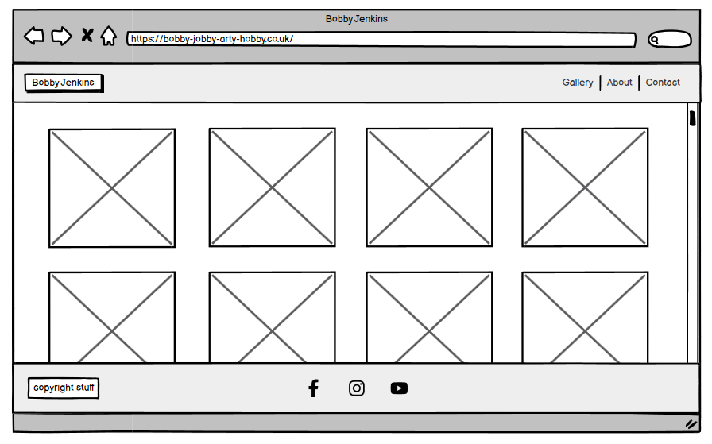
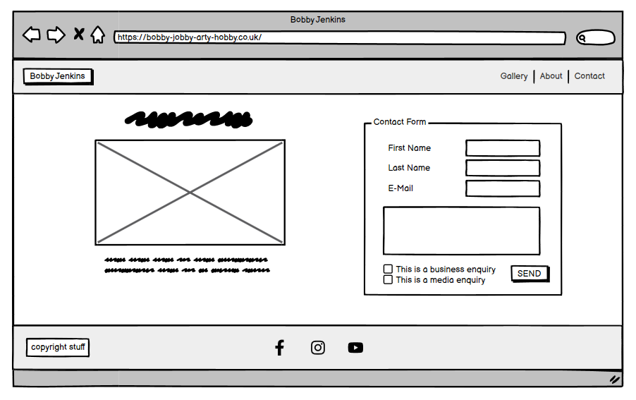

# Project Art Portfolio

The aim is to create a simple, aesthetic art portfolio for an artist to showcase some of their work and provide contact details to prospective clients.

You can view the deployed website [here](placeholder for GitHub Pages deployment)

/*Placeholder - site displayed on multiple devices*/

#
# UX

The work of the artist will be forefront. Navigation will be simple and clear. A gallery section will display multiple examples of the artist's work, an About Me/Blog section will provide updates on the artist's current and recent projects, and there will be a contact page with a call-to-action encouraging making contact with the artist to commission work.

## Users Stories 

- As a new user of this website, I want to quickly and easily view examples of this artist's work.
- As a new user of this website, I want to quickly and easily be able to contact the artist if needed.
- As a new user of this website, I want to easily be able to learn more about the artist themselves.
- As a new user of this website, I want to follow the artist on social media so I can keep up to date with the latest information.

#
# Scope 

## Features

- An easy and simple navigation throughout the website.
- A gallery of past work.
- An About Me to provide insight into current work.
- A clear and straightforward contact form, so that potential clients can easily get in touch with the artist.
- Social links in the footer of each page so user can follow the artist via social networks and be up to date with the latest information

### Future Features

- Develop "About Me" into an ongoing "Blog"
- Availability calendar for any user seeking specific dates for a commission.
- Replace static hero image with cover flow of multiple images
- Increase responsiveness of landing page -> larger buttons outside of hero-text with seperate images?

#
# Structure (TBC)

- **Header**  
    - Artist name/logo positioned left, navigation bar on the right
    - Appears on every page

- **Nav bar**
    - Appears on every page so users can easily navigate throught the site

- **Footer**
    - Appears on every page with link to contact page and all social media links

 - **Home Page**
    - *Hero image* - Showcase Bobby at work and call-to-action for differeing users (More about the artist, make an enquiry, view gallery)
    - *Hero Text box*
        - *About the Artist* - Call-to-action button linking the about page.
        - *Gallery* - Call-to-action button linking the gallery page
        - *Contact* - Call to action directing user to contact page for users expressly looking to make contact.
    
- **About the Artist** - Name and Profile image on left with some honours listed below, information on right. Introduces the artist to users. Also link in about text to contact page highlighting availability for work.

- **Gallery** - Simple easthetic to highlight the art. Allows the user to see multiple examples of the the artist's work. 

- **Contact** - Allows the user to contact the artist by form. Radio button to tag the nature of the enquiry.

# Wireframes

### _Mobile View - Home Page_

### _Mobile View - About_

### _Mobile View - Gallery_

### _Mobile View - Contact_

### _Home Page_ 

### _About_

### _Gallery_

### _Contact_

# Surface

## Design 
The priority of the artist/client is to showcase their work. We decided that a clean, monochrome style would highlight the colourful work of the artist. The dominant background colour will be grey, header/footer will be a significantly darker grey, text will be a very pale grey and appear over the same darker grey used for the header and footer; this will maximise contrast and visibility while not disctracting the eye from the art on display. The artist would like this site to generate both awareness and work, so prominent buttons will appear on the landing page directing the user to the appropriate page. The contact form page should have a required radio button for "nature of enquiry" to allow the artist to filter their incoming messages.

## Chosen Colour Palette 
-
-
-
-
-
-

## Fonts 

-
-
-

## Media

**Hero image** - 

**About Me** - 

**Gallery** - 

**Contact** - 

# Technologies Used

## Languages 

- [HTML5](https://en.wikipedia.org/wiki/HTML5)
- [CSS3](https://en.wikipedia.org/wiki/CSS)

## Frameworks, Libraries & Programs Used

- [Google Fonts](https://fonts.google.com/https://fonts.google.com/) - provide all of the fonts for this website.

- [Font Awesome](https://fontawesome.com/) -was used for the site icos.

- [Github](https://github.com/IrisSmok) - was used to store the project code.

- [Balsamiq](https://balsamiq.com/) - was used to create site wireframes.

- /*[Shutterstock](https://www.shutterstock.com/home) and [Unsplash photo](https://unsplash.com/) - was used to for all images on the website.*/

- [Am I Responsive](http://ami.responsivedesign.is/) - to check if the site is responsive on different screen sizes.

- /*[IMG2GO](https://www.img2go.com/compress-image#j=f26cc008-23b4-4d4e-9934-96877fa9a7e7) and [Tiny PNG](https://tinypng.com/) - these sites were used to help me compress the images*/

- /*[Free Online HTML Formatter](https://www.freeformatter.com/html-formatter.html) - was used to correct indentation issues and get rid of too much whitespace*/

# Testing
- Tested on . . . version browsers
- Chrome Developer Tools are used to test the responsiveness on: Desktop, Laptop, Moto G4, Galaxy S5, iPhone 5/SE, iPhone 6,7,8, iPhone 6,7,8 Plus, iPad, iPad Pro, Galaxy Fold

# Validating 
The W3C Markup Validator and W3C CSS Validator Services were used to check my code for syntax errors in this project.

- [HTML](https://validator.w3.org/#validate_by_input)- I checked each page by direct input method on HTML validator site

- [CSS](https://jigsaw.w3.org/css-validator/)

- I used Lighthouse tools to test my website

## User Story Testing

### **Testing Users Stories form (UX) Section**

1.  As a new user of this website, I want to quickly and easily view examples of this artist's work.
    -  Navigation is clear and consistent from page-to-page. Artwork is prominently displayed throughout all pages.

 *Desktop,Laptop View*

        

 *Tablet View* 

 *Phone View*

2. As a new user of this website, I want to quickly and easily be able to contact the artist if needed

    - The user can easily find contact information that is readable and clear

3. As a new user of this website, I want to easily be able to learn more about the artist themselves.

    - The About Me section is easily found and presents more information about the artist themselves.

4. As a new user of this website, I want to follow the artist on social media so I can keep up to date with the latest information

    - Social links appear in the footer on each page and in larger format on the contact page.

  

## Bugs and Issues

- TBC

- Design improvment- 

- For the Gallery Lighthouse report-

### **HTML Validator** 

- *Warning* : 

- *Warning* : 

### **CSS Validator** 

- *Value Error* : 

- *Warning* :  

- *Warning* : 

- *Warning* : 

- *Warning* 

# Final Product 

## Desktop View 
 
### _Home Page_

### _About_

### _Gallery_

### _Contact_

## Tablet View 
 
### _Home Page_

### _About_

### _Gallery_

### _Contact_

## Mobile View 
 
### _Home Page_

### _About Me_

### _Gallery_

### _Contact_

# Deployment

## GitHub Pages
1. Log into GitHub and locate the repository.
2. At the top locate the settings option 
3. Scroll towards  the bottom of the page and locate GitHub Pages 
4. Click on the link "Check it out here!"
4. Under 'Source' dropdown, click 'Master' from the options.
5. Click the save button.
6. The site is now published, it may not be available immediately. 
7. The site URL is visible on the green bar under the "Github Pages".
8. The latest deployed version can be seen [here](https://profyaffle88.github.io/project-art-portfolio/)

# Credits

## Content

- All content was written by [MorgaanW](https://github.com/MorgaanW), [fawyl](https://github.com/fawyl), [Graciete-Gil](https://github.com/Graciete-Gil) and [ProfYaffle88](https://github.com/users/ProfYaffle88)
- The format of this ReadMe.md was adapted from a docoument by [Iris Smok](https://github.com/Iris-Smok)
- The structure of the gallery page was adapted from the [Responsive Gallery Design on W3 Schools](https://www.w3schools.com/css/css_image_gallery.asp)
- The header, footer and navbar were adapted from the [Love-Running Code Institute project](https://github.com/Code-Institute-Solutions/love-running-v3)
- Stack Overflow provided several solutions to multiple issues including alignment, positioning, and responsiveness. [Stack Overflow](https://stackoverflow.com/questions)

## Media

- All images used were made by AI-generated sources
    -
    -

## Acknowledgements

- Thanks to w3 Schools, Stack Overflow, Code Institute and above all the holy trinity of instructors; Iris, Martin and Kevin.
